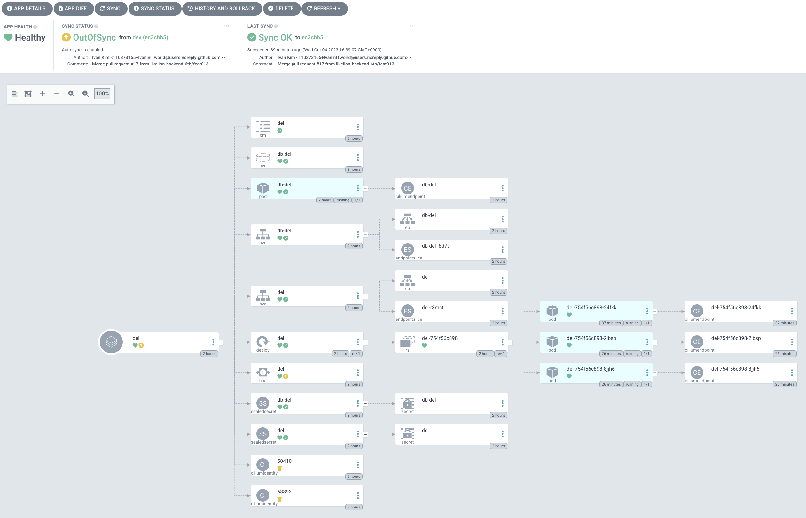

# 3-way Communication

## Project Detail

주문, 오더를 중심으로 고객, 사장, 배달크루 이렇게 3개의 주체가 같은 정보를 바라보며 움직여야 합니다. 고객의 요구사항을 정확히 파악해서 전달하고 각 파트에서 담당한 일들이 처리되는 과정들의 진행상황을 공유하여 발생한 이벤트에 대한 같은 정보를 인지할 수 있게 합니다.

#### 기간 : 2023.09.24 - 2023.10.24

#### 배포 주소 : - 예진

## Team

#### 김민혁 - [민혁's task list](https://fire-apartment-b43.notion.site/8657cd5eb06247d9b3d30b6e5f233d77?v=3cdeb751b90d4de0affbf249d3ffd771&pvs=4)

- Terraform - IaC NCP kubernetest cluster
- Helm - helpers, Deployment, SVC, PVC, Configmap, Secret
- Helm - Seal Secret, Horizontal Pod Autoscaler
- Argo CD - CD (Automate sync, ref github repo)
- Backend - sajjang function(urls, views, templates)
- Backend - delivery_crew function(urls, views, templates)
- Dev env - Dummy data creation command
- Dev env - Mixin (permission check for each Group)

#### 전예진

#### 문건우

#### 이한솔 - [한솔's task list](https://fire-apartment-b43.notion.site/d04f0351d61d484ba636c550ecdb5278?v=852e57dcff794e20994793884f407bc2)

- API 명세서 작성
- DB modeling
- ERD 작성
- store app 작성
- customer home 제작
- endpoint 별 template 생성
- delivery_crew url, view 뼈대 작성
- 로그인 템플릿 작성
- customer view 구현
- sajjang template 작성
- 발표 자료 제작

#### 정해민

#### 한승훈 - [승훈's task list](https://fire-apartment-b43.notion.site/260896c24f46404da53f49b728bdaba0?v=04f0c5a217a14c1595b5598704d9b42c&pvs=4)

- Order 기능 모델링
- Cart, Menu 모델 구현
- customer basic template & cancel function 구현

## Tech Stack

#### Frontend - 건우

#### Backend - 해민

#### Infra - 예진

## Requirements

- Django==4.2.5
- gunicorn==21.2.0
- psycopg2-binary==2.9.7
- django-seed==0.3.1
- Faker==19.6.2
- boto3==1.28.54
- botocore==1.31.54
- Pillow==10.0.1
- stripe==6.7.0
- pytest-django==4.5.2
- Faker==19.6.2
- django-prometheus==2.3.1

## ERD - 해민

## API statements - 건우

## Page Work Flow - 해민

## Main Functionality

### Frontend

### Backend

#### customer

- 주소 추가 기능
- 기본 주소 설정 기능
- 카테고리별 가게 검색 기능
- 가게 이름 검색 기능
- 장바구니 기능
- 장바구니 가게별 주문 기능
- 장바구니 상품 개수 수정 기능
- 주문 상태 표시 기능 (결제완료/조리중/배달중/배달완료)

#### sajjang

- 가게 추가 기능
- 가게 수정 기능
- 메뉴 추가 기능
- 메뉴 수정 기능
- 주문 수락/거절 기능

#### delivery_crew

- 배달 주문 수락/거절 기능
- 경로 보기 기능

### Infra

## Architecture - 민혁

(아키텍쳐: 백엔드와 프론트엔드가 어떻게 소통하는지)

## Installation & Run - 민혁

---

# If we need to use image file, please use the below method

