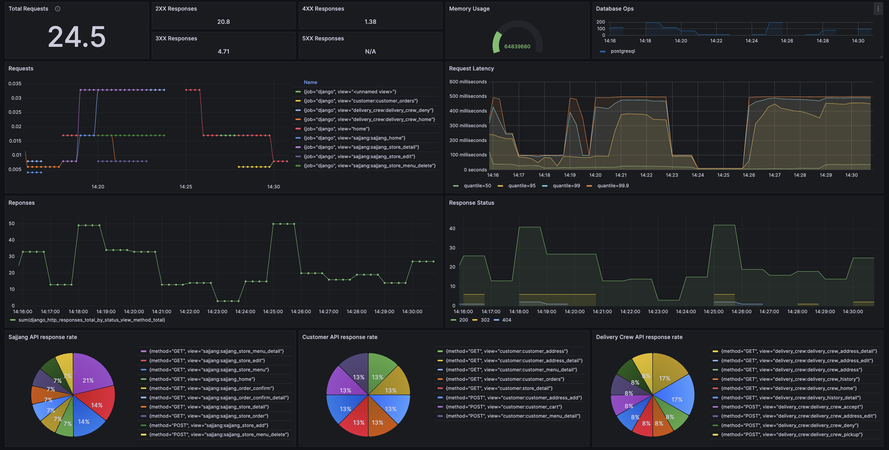

# 3-way Communication

(대표 이미지 or 로고) - 한솔님


[](https://hits.seeyoufarm.com)

## Project Detail

주문, 오더를 중심으로 고객, 사장, 배달크루 이렇게 3개의 주체가 같은 정보를 바라보며 움직여야 합니다. 고객의 요구사항을 정확히 파악해서 전달하고 각 파트에서 담당한 일들이 처리되는 과정들의 진행상황을 공유하여 발생한 이벤트에 대한 같은 정보를 인지할 수 있게 합니다.

#### 기간 : 2023.09.24 - 2023.10.24

#### 배포 주소 : default-del-4f995-20158617-bc493112b475.kr.lb.naverncp.com

## Team

#### 김민혁 - [민혁's task list](https://fire-apartment-b43.notion.site/8657cd5eb06247d9b3d30b6e5f233d77?v=3cdeb751b90d4de0affbf249d3ffd771&pvs=4)

- Terraform - IaC NCP kubernetest cluster
- Helm - helpers, Deployment, SVC, PVC, Configmap, Secret
- Helm - Seal Secret, Horizontal Pod Autoscaler
- Argo CD - CD (Automate sync, ref github repo)
- Backend - sajjang function(urls, views, templates)
- Backend - delivery_crew function(urls, views, templates)
- Dev env - Dummy data creation command
- Dev env - Mixin (permission check for each Group)

#### 전예진 - [예진's task list](https://www.notion.so/a11c39f4269d49b2a2ade0d3db1ed754?v=3ce19a01b62245f7a080659c5a5f4cf0&pvs=4)

- GitHub Actions - CI/CD (tag release)
- Prometheus - system monitoring, metric collection
- Grafana - visualize data, create custom dashboards
- Backend - customer function(view, templates)
- Backend - sajjang function(view, templates)

#### 문건우

#### 이한솔

#### 정해민

#### 한승훈 - [승훈's task list](https://fire-apartment-b43.notion.site/260896c24f46404da53f49b728bdaba0?v=04f0c5a217a14c1595b5598704d9b42c&pvs=4)

- Order 기능 모델링
- Cart, Menu 모델 구현
- customer basic template & cancel function 구현

## Tech Stack

#### Frontend 


#### Backend


#### Infra

   
 
  
  
  
  
  
  
  

## Requirements - 한솔

- aa
- bb
- cc

## ERD - 해민

## API statements - 건우

## Page Work Flow - 해민

## Main Functionality - 해민, 건우, 한솔, 예진

#### Frontend

#### Backend

#### Infra

* ```Docker```, ```Kubernetes```를 통해 애플리케이션을 컨테이너화 하여 배포하고 관리합니다.
* ```Terraform```을 통해 인프라의 프로비저닝 및 관리를 수행합니다.
* ```Helm Chart```를 통해 애플리케이션 구성을 관리하고 업데이트합니다.
* ```GitHub Actions```를 통해 CI/CD 파이프라인을 구축하여 코드 변경 사항을 자동으로 빌드, 테스트, 및 배포합니다.
* ```ArgoCD```를 통해 Kubernetes 클러스터 배포를 자동화하고 Git 저장소와 실제 클러스터 상태를 동기화합니다.
* ```Grafana```와 ```Prometheus```를 통해 애플리케이션 및 인프라의 모니터링을 구축하고 지표를 시각화합니다.

#### Monitoring



## Architecture - 민혁

(아키텍쳐: 백엔드와 프론트엔드가 어떻게 소통하는지)

## Installation & Run - 민혁

---

# If we need to use image file, please use the below method


