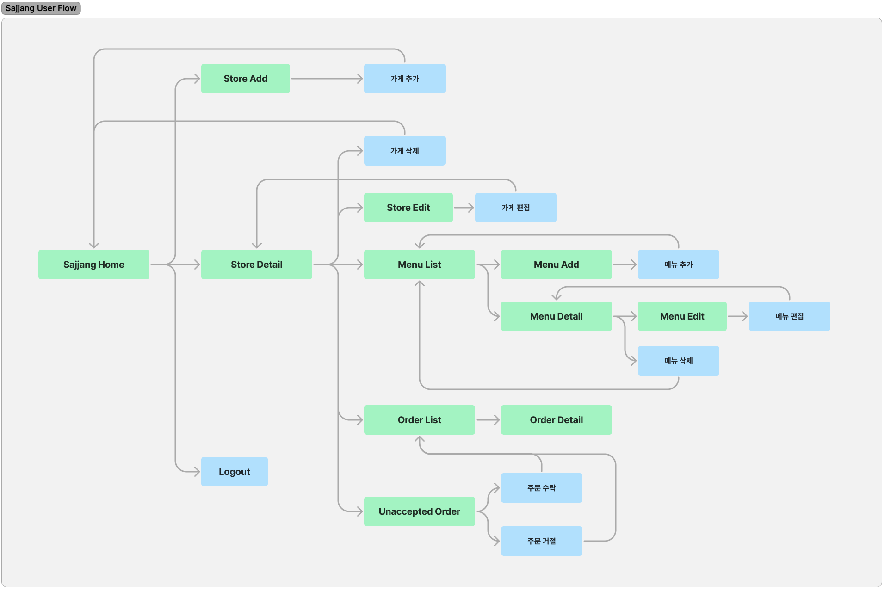

# 3-way Communication


<div align="left">
  

[](https://hits.seeyoufarm.com)

</div>

## Project Detail

주문, 오더를 중심으로 고객, 사장, 배달크루 이렇게 3개의 주체가 같은 정보를 바라보며 움직여야 합니다. 고객의 요구사항을 정확히 파악해서 전달하고 각 파트에서 담당한 일들이 처리되는 과정들의 진행상황을 공유하여 발생한 이벤트에 대한 같은 정보를 인지할 수 있게 합니다.

#### 기간 : 2023.09.24 - 2023.10.24

#### 배포 주소 : default-del-4f995-20158617-bc493112b475.kr.lb.naverncp.com

## Team

#### 김민혁 - [민혁's task list](https://fire-apartment-b43.notion.site/8657cd5eb06247d9b3d30b6e5f233d77?v=3cdeb751b90d4de0affbf249d3ffd771&pvs=4)

- Terraform - IaC NCP kubernetest cluster
- Helm - helpers, Deployment, SVC, PVC, Configmap, Secret
- Helm - Seal Secret, Horizontal Pod Autoscaler
- Argo CD - CD (Automate sync, ref github repo)
- Backend - sajjang function(urls, views, templates)
- Backend - delivery_crew function(urls, views, templates)
- Dev env - Dummy data creation command
- Dev env - Mixin (permission check for each Group)

#### 전예진 - [예진's task list](https://www.notion.so/a11c39f4269d49b2a2ade0d3db1ed754?v=3ce19a01b62245f7a080659c5a5f4cf0&pvs=4)

- GitHub Actions - CI/CD (tag release)
- Prometheus - system monitoring, metric collection
- Grafana - visualize data, create custom dashboards
- Backend - customer function(view, templates)
- Backend - sajjang function(view, templates)

#### 문건우 - [건우's task list](https://www.notion.so/bc23e3c6244e4862aa0d123ccb10288b?v=566d2a8680ce471c9d3a32b56e815d9e)

- Backend - customer function(views, templates)
- Backend - sajjang function(views, templates)
- Backend - delivery crew function(urls, views, templates)
- Frontend - account, customer, sajjang, delivery crew(Bootstrap)

#### 이한솔 - [한솔's task list](https://fire-apartment-b43.notion.site/d04f0351d61d484ba636c550ecdb5278?v=852e57dcff794e20994793884f407bc2)

- API 명세서 작성
- DB modeling
- ERD 작성
- store app 작성
- customer home 제작
- endpoint 별 template 생성
- delivery_crew url, view 뼈대 작성
- 로그인 템플릿 작성
- customer view 구현
- sajjang template 작성
- 발표 자료 제작

#### 정해민 - [해민's task list](https://www.notion.so/7845ddd52ef74cdda467b4a1ebfafb2a?v=9960c551d69944e58671cfe491287647&pvs=4)

- DataBase - design ERD
- BackEnd - account function (urls, views, templates)
- BackEnd - customer function (urls, views, templates)
- BackEnd - payment (using Stripe)
- BackEnd - delivery Crew (T Map API navigation)

#### 한승훈 - [승훈's task list](https://fire-apartment-b43.notion.site/260896c24f46404da53f49b728bdaba0?v=04f0c5a217a14c1595b5598704d9b42c&pvs=4)

- Order 기능 모델링
- Cart, Menu 모델 구현
- customer basic template & cancel function 구현

## Tech Stack

#### Frontend

<div align="left">


</div>

#### Backend

<div align="left">


</div>

#### Infra

<div align="left">

 


 

 

 

 

 

 

 
</div>

## Requirements

- Django==4.2.5
- gunicorn==21.2.0
- psycopg2-binary==2.9.7
- django-seed==0.3.1
- Faker==19.6.2
- boto3==1.28.54
- botocore==1.31.54
- Pillow==10.0.1
- stripe==6.7.0
- pytest-django==4.5.2
- Faker==19.6.2
- django-prometheus==2.3.1

## ERD - 해민


## API statements

<details>
<summary>Account</summary>
<div markdown="1">

| Method | URL             | Description   |
| ------ | --------------- | ------------- |
| GET    | /               | 홈 화면       |
| POST   | /account/signin | 로그인        |
| GET    | /account/signup | 회원가입 화면 |
| POST   | /account/signup | 회원가입      |
| POST   | /logout         | 로그아웃      |

</div>
</details>

<details>
<summary>Customer</summary>
<div markdown="1">

| Method | URL                                                     | Description                   |
| ------ | ------------------------------------------------------- | ----------------------------- |
| GET    | /customer/home                                          | customer 홈페이지             |
| GET    | /customer/address                                       | 주소 조회 페이지              |
| GET    | /customer/address/add                                   | 주소 추가 페이지              |
| POST   | /customer/address/add                                   | 주소 추가                     |
| GET    | /customer/address/<<int:address_id>>                    | 주소 상세 페이지              |
| GET    | /customer/address/<<int:address_id>>/edit               | 주소 수정 페이지              |
| POST   | /customer/address/<<int:address_id>>/edit               | 주소 수정                     |
| POST   | /customer/address/<<int:address_id>>/delete             | 주소 삭제                     |
| GET    | /customer/store/<<int:stores_id>>                       | 가게 상세보기                 |
| GET    | /customer/store/<<int:stores_id>>/menu                  | 가게 메뉴 리스트 보기         |
| GET    | /customer/store/<<int:stores_id>>/menu/<<int:menus_id>> | 가게 메뉴 상세 보기           |
| POST   | /customer/store/<<int:stores_id>>/menu/<<int:menus_id>> | 장바구니 추가                 |
| GET    | /customer/cart                                          | 고객의 장바구니 조회          |
| GET    | /customer/orders                                        | 유저의 주문 내역 리스트 조회  |
| GET    | /customer/order/<<int:order_id>>                        | 주문 내역 상세보기            |
| GET    | /customer/order/create/<<int:store_id>>                 | 주문서 작성 결과 보기         |
| POST   | /customer/order/create/<<int:store_id>>                 | 주문 항목 수정                |
| POST   | /customer/payment                                       | Stripe 결제 페이지 리다이렉트 |
| GET    | /customer/pay_complete                                  | 고객 결제 완료                |
| GET    | /customer/pay_cancel                                    | 고객 결제 취소                |

</div>
</details>

<details>
<summary>Sajjang</summary>
<div markdown="1">

| Method | URL                                                                   | Description             |
| ------ | --------------------------------------------------------------------- | ----------------------- |
| GET    | /sajjang/home                                                         | sajjang 홈페이지        |
| GET    | /sajjang/store/add                                                    | 가게 등록 페이지        |
| POST   | /sajjang/store/add                                                    | 가게 등록               |
| GET    | /sajjang/store/<<int:store_id>>                                       | 가게 정보 상세 보기     |
| GET    | /sajjang/store/<<int:store_id>>/edit                                  | 가게 정보 수정 페이지   |
| POST   | /sajjang/store/<<int:store_id>>/edit                                  | 가게 정보 수정          |
| POST   | /sajjang/store/<<int:store_id>>/delete                                | 가게 삭제               |
| GET    | /sajjang/store/<<int:store_id>>/menu                                  | 가게 메뉴 보기          |
| GET    | /sajjang/store/<<int:store_id>>/menu/add                              | 가게 메뉴 등록          |
| POST   | /sajjang/store/<<int:store_id>>/menu/add                              | 가게 메뉴 등록          |
| GET    | /sajjang/store/<<int:store_id>>/menu/<<int:menu_id>>                  | 가게 메뉴 상세보기      |
| GET    | /sajjang/store/<<int:store_id>>/menu/<<int:menu_id>>/edit             | 가게 메뉴 수정 페이지   |
| POST   | /sajjang/store/<<int:store_id>>/menu/<<int:menu_id>>/edit             | 가게 메뉴 수정          |
| POST   | /sajjang/store/<<int:store_id>>/menu/<<int:menu_id>>/delete           | 가게 메뉴 삭제          |
| GET    | /sajjang/store/<<int:store_id>>/order                                 | 가게 수락한 주문 조회   |
| GET    | /sajjang/store/<<int:store_id>>/order/<<int:order_id>>                | 가게 주문 상세 페이지   |
| GET    | /sajjang/store/<<int:store_id>>/order/confirm                         | 고객이 결제한 주문 조회 |
| GET    | /sajjang/store/<<int:store_id>>/order/confirm/<<int:order_id>>        | 결제한 주문 상세보기    |
| POST   | /sajjang/store/<<int:store_id>>/order/confirm/<<int:order_id>>/accept | 고객이 결제한 주문 수락 |
| POST   | /sajjang/store/<<int:store_id>>/order/confirm/<<int:order_id>>/reject | 고객이 결제한 주문 거절 |

</div>
</details>

<details>
<summary>Delivery Crew</summary>
<div markdown="1">

| Method | URL                                                       | Description                    |
| ------ | --------------------------------------------------------- | ------------------------------ |
| GET    | /delivery_crew/home                                       | delivery_crew 홈페이지         |
| GET    | /delivery_crew/delivery_history                           | 해당 크루의 배달 기록          |
| GET    | /delivery_crew/delivery_history/<<int:order_id>>          | 배달항목의 디테일              |
| POST   | /delivery_crew/<<int:order_id>>/accept                    | 배달 요청 수락                 |
| POST   | /delivery_crew/<<int:order_id>>/deny                      | 배달 거절                      |
| POST   | /delivery_crew/delivery_history/<<int:order_id>>/pickup   | 배달 배정 완료 → 배달 중       |
| POST   | /delivery_crew/delivery_history/<<int:order_id>>/complete | 배달 중 → 배달 완료            |
| GET    | /delivery_crew/address/                                   | delivery_crew 위치             |
| GET    | /delivery_crew/address/add/                               | delivery_crew 위치 추가 페이지 |
| POST   | /delivery_crew/address/add/                               | delivery_crew 위치 추가        |
| GET    | /delivery_crew/address/<<int:address_id>>/                | delivery_crew 위치 상세보기    |
| GET    | /delivery_crew/address/<<int:address_id>>/edit/           | delivery_crew 위치 수정 페이지 |
| POST   | /delivery_crew/address/<<int:address_id>>/edit/           | delivery_crew 위치 수정        |
| POST   | /delivery_crew/address/<<int:address_id>>/delete/         | delivery_crew 위치 삭제        |

</div>
</details>

## Page Work Flow - 해민





## Main Functionality

### Frontend

- `Django Template` 상속을 통해 코드가 중복되지 않도록 합니다.
- `Bootstrap`을 활용해 HTML 태그에 class 속성을 추가해 디자인합니다.

### Backend

#### account

- Sign-in, Sign-out, Sign-up

  

#### customer

- 주소 추가 기능
- 기본 주소 설정 기능
- 카테고리별 가게 검색 기능
- 가게 이름 검색 기능
- 장바구니 기능
- 장바구니 가게별 주문 기능
- 장바구니 상품 개수 수정 기능
- 결제 기능
- 주문 상태 표시 기능 (결제완료/조리중/배달중/배달완료)

  

#### 1) Account


```회원가입/로그인/로그아웃``` 
- 사용자는 중복되지 않는 이름과 비밀번호를 이용하여 계정을 생성할 수 있다.
- 사용자는 고객/사장/라이더의 권한을 설정하여 회원가입할 수 있다.
- 사용자는 로그인, 로그아웃을 수행할 수 있다.


#### 2) customer


```Search```
- 사용자는 Home 화면에서 가게를 검색할 수 있다.
- 사용자는 Home 화면에서 카테고리 별로 가게를 조회할 수 있다.


```Address```
- 사용자는 자신이 배달받을 주소를 여러개 생성할 수 있다. 
- 사용자는 기본(default)주소를 설정할 수 있으며, 이는 최상단에서 확인할 수 있다. 
- 사용자는 우편번호 찾기를 통해 주소를 검색하고, 설정할 수 있다.


```Cart/Order```
- 사용자는 가게별로 주문하고자 하는 메뉴를 장바구니에 담을 수 있다.
- 사용자는 장바구니에서 상품 개수를 설정할 수 있다.
- 사용자는 가게별로 주문하고자 하는 메뉴를 결제할 수 있다.
- 사용자는 주문 페이지에서 상품 개수 및 주소를 설정할 수 있다.
- 사용자는 자신의 주문 목록을 조회할 수 있으며, 배달중/배달완료/조리중 등의 상태를 확인할 수 있다.


```Payment```
- 사용자는 자신의 카드 정보를 입력하여 결제할 수 있다.
  
#### 3) sajjang


- 사장은 자신의 가게를 추가, 수정할 수 있다
- 사장의 자신의 가게에 대한 메뉴를 추가하고 수정할 수 있다.
- 사장은 주문 실시간으로 가게에 대한 주문을 조회/수락/거절할 수 있다.

#### 4) delivery_crew


- 라이더는 자신에게 요청된 배달 주문을 수락 또는 거절할 수 있다.
- 라이더는 주문을 수락했다면, 해당 위치에 대한 경로를 제공받는다. 
- 배달이 완료된 경우, 해당 주문에 대한 주문 수락/거절 버튼은 비활성화된다.
- 배달 주문 수락/거절 기능
- 경로 보기 기능 (Navigatet from store to customer)

  

- 배달 완료

  


### Infra

- `Docker`, `Kubernetes`를 통해 애플리케이션을 컨테이너화 하여 배포하고 관리합니다.
- `Terraform`을 통해 인프라의 프로비저닝 및 관리를 수행합니다.
- `Helm Chart`를 통해 애플리케이션 구성을 관리하고 업데이트합니다.
- `GitHub Actions`를 통해 CI/CD 파이프라인을 구축하여 코드 변경 사항을 자동으로 빌드, 테스트, 및 배포합니다.
- `ArgoCD`를 통해 Kubernetes 클러스터 배포를 자동화하고 Git 저장소와 실제 클러스터 상태를 동기화합니다.
- `Grafana`와 `Prometheus`를 통해 애플리케이션 및 인프라의 모니터링을 구축하고 지표를 시각화합니다.

#### Monitoring


## Architecture - 민혁

(아키텍쳐: 백엔드와 프론트엔드가 어떻게 소통하는지)

---

# If we need to use image file, please use the below method


